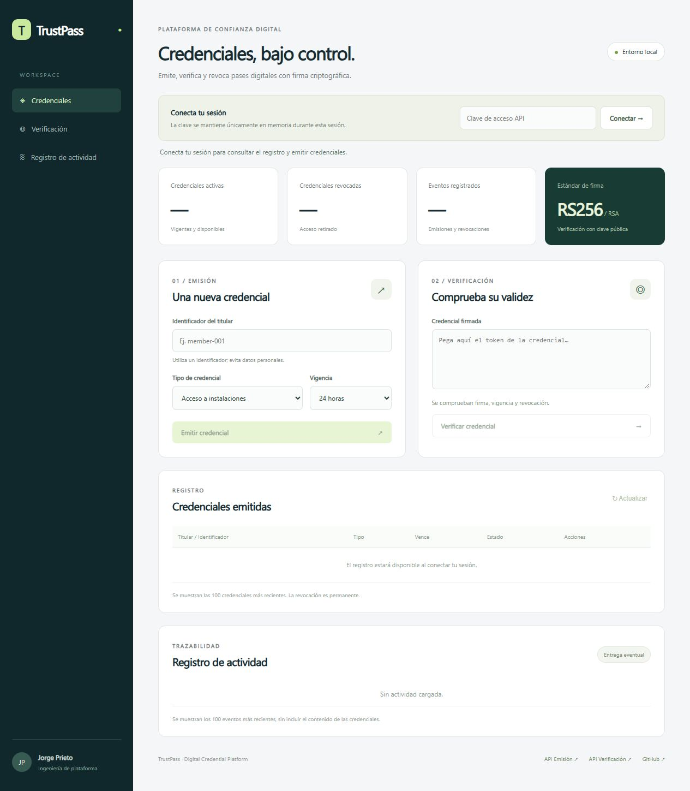
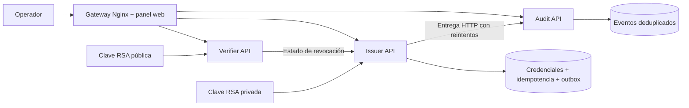

# TrustPass — Digital Credential Platform

[](https://github.com/jorgefprietol/trustpass-platform/actions/workflows/ci.yml)

Plataforma de credenciales digitales para controlar accesos, certificaciones profesionales y pases de eventos. Integra emisión con **firma RSA**, verificación independiente, revocación inmediata y auditoría con entrega durable de eventos, mediante tres microservicios y un gateway.

Proyecto independiente de ingeniería desarrollado por **Jorge Prieto**. Su alcance, decisiones y comprobaciones están documentados para revisión técnica y reproducción local.



Vista inicial del panel; los registros y contadores se cargan al conectar una sesión autenticada.

## Capacidades

- Emisión de JWT firmados con RS256; clave privada disponible únicamente en el emisor. Rotación por `kid`, JWKS y conservación de claves públicas anteriores.
- Verificación de firma, algoritmo permitido, emisor, audiencia, fechas y estado de revocación.
- Idempotencia persistente de emisión, incluyendo solicitudes concurrentes y reinicios.
- Patrón transactional outbox con espera exponencial, jitter, cola de errores recuperable y deduplicación en auditoría.
- Gateway con límites de tráfico y tamaño, política CSP y aislamiento de endpoints internos.
- Panel web adaptable: emisión, validación, revocación y consulta de actividad.
- Contratos OpenAPI versionados, métricas Prometheus y logs JSON correlacionados.
- Contenedores sin root, filesystem de solo lectura, límites de recursos y secretos montados.
- GitHub Actions: calidad en Windows y Linux, pruebas, auditoría de dependencias, integración real, escaneo, SBOM y publicación en GHCR con atestaciones.

## Arquitectura



Los servicios comparten una imagen de aplicación y se ejecutan como procesos y contenedores separados. Cada contexto conserva su propio almacenamiento; la comunicación entre servicios ocurre por HTTP. El verificador necesita al emisor para comprobar revocaciones y responde 503 si esa dependencia no está disponible.

## Inicio rápido

Requisitos: Docker Desktop con contenedores Linux, Docker Compose y Python 3.12. La ejecución ocupa aproximadamente 1 GB de memoria como límite configurado total.

```powershell
git clone https://github.com/jorgefprietol/trustpass-platform.git
cd trustpass-platform
python -m venv .venv
.\.venv\Scripts\python -m pip install --require-hashes -r requirements-dev.lock
.\.venv\Scripts\python scripts/init-env.py
docker compose up -d --build --wait --wait-timeout 180
```

Abrir **[http://127.0.0.1:18120](http://127.0.0.1:18120)**. Leer la clave local con `Get-Content .secrets/api-token` y pegarla en «Conecta tu sesión». La interfaz mantiene la clave en memoria y limpia el campo después de conectar; no la guarda en el navegador.

En Linux/macOS, activar el entorno con `source .venv/bin/activate` y usar `python` para los mismos comandos. `.env` y `.secrets/` se generan en cada instalación; no se publican ni se incluyen en imágenes. El script de inicialización conserva las claves existentes y evita regenerarlas durante un reinicio.

## Ejemplo de API

```powershell
$token = (Get-Content .secrets/api-token -Raw).Trim()
$headers = @{ Authorization = "Bearer $token"; 'Idempotency-Key' = [guid]::NewGuid().ToString() }
$body = @{ subject = 'member-001'; category = 'facility-access'; valid_for_seconds = 86400 } | ConvertTo-Json
$credential = Invoke-RestMethod http://127.0.0.1:18120/api/v1/credentials -Method Post -Headers $headers -ContentType application/json -Body $body
$verification = @{ token = $credential.token } | ConvertTo-Json
Invoke-RestMethod http://127.0.0.1:18120/api/v1/verifications -Method Post -Headers $headers -ContentType application/json -Body $verification
Invoke-RestMethod "http://127.0.0.1:18120/api/v1/credentials/$($credential.id)/revoke" -Method Post -Headers $headers
```

| Operación | Endpoint |
| --- | --- |
| Emitir / listar credenciales | `POST /api/v1/credentials` / `GET /api/v1/credentials` |
| Revocar | `POST /api/v1/credentials/{id}/revoke` |
| Verificar | `POST /api/v1/verifications` |
| Consultar eventos | `GET /api/v1/events` |
| Consultar clave pública | `GET /.well-known/jwks.json` |
| Contratos OpenAPI | `GET /contracts/issuer.json`, `/contracts/verifier.json`, `/contracts/audit.json` |

Una misma clave de idempotencia y un cuerpo idéntico reproducen la respuesta de emisión original. Reutilizarla con otro cuerpo devuelve 409. Los listados muestran hasta 100 entradas recientes. La interfaz sólo presenta datos reales consultados a las APIs.

## Verificación

```powershell
.\.venv\Scripts\python -m ruff check .
.\.venv\Scripts\python -m ruff format --check .
.\.venv\Scripts\python -m pytest
.\.venv\Scripts\python -m pip_audit --require-hashes -r requirements.lock
.\.venv\Scripts\python scripts/export-contracts.py
.\.venv\Scripts\python scripts/e2e.py
```

Las pruebas E2E requieren el stack local en ejecución. Detienen temporalmente emisor y auditoría para verificar rechazo durante fallos, recuperación de eventos y persistencia tras reinicio. Los informes no incluyen claves ni tokens y quedan en `artifacts/`. Utilizar este comando en un entorno de verificación dedicado.

## Entrega continua

El pipeline valida calidad y contratos en Windows y Linux. Construye las imágenes de aplicación y gateway una sola vez, ejecuta integración con Docker Compose y bloquea vulnerabilidades HIGH/CRITICAL con corrección disponible. Publica evidencias, dos SBOM y, después de aprobar los controles, **las mismas imágenes probadas** en:

- `ghcr.io/jorgefprietol/trustpass-platform`
- `ghcr.io/jorgefprietol/trustpass-platform-gateway`

Cada imagen se etiqueta con `sha-<commit>` y `main`, y obtiene una atestación de procedencia. Los PR verifican sin publicar imágenes. El despliegue local es reproducible con Compose; la promoción a infraestructura remota requiere configurar ese destino.

Para desplegar imágenes publicadas, sustituir `APP_IMAGE` y `GATEWAY_IMAGE` en `.env` por las referencias con digest `@sha256:...` verificadas en Actions y ejecutar `docker compose up -d --no-build --wait`. Mantener copias de los volúmenes y de las claves antes de sustituir imágenes.

## Documentación técnica

- [Arquitectura y decisiones](docs/architecture.md)
- [Operación y recuperación](docs/operations.md)
- [Modelo de seguridad](SECURITY.md)
- [Experiencia técnica del proyecto](docs/experience.md)
- [Contratos versionados](contracts/)

Licencia MIT.
